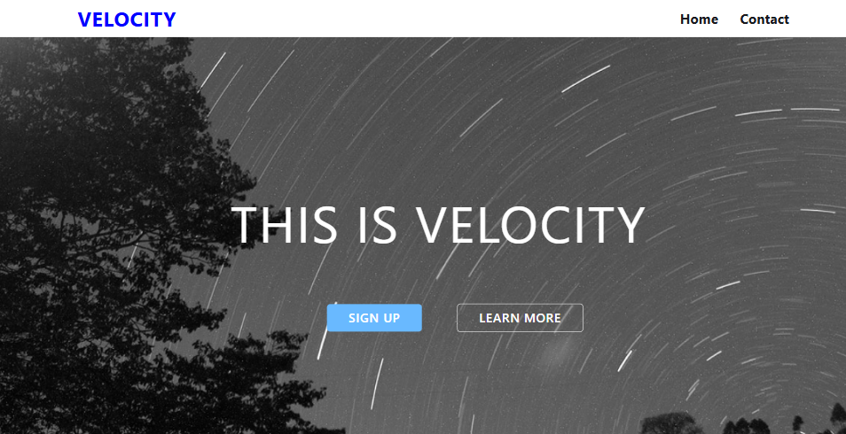
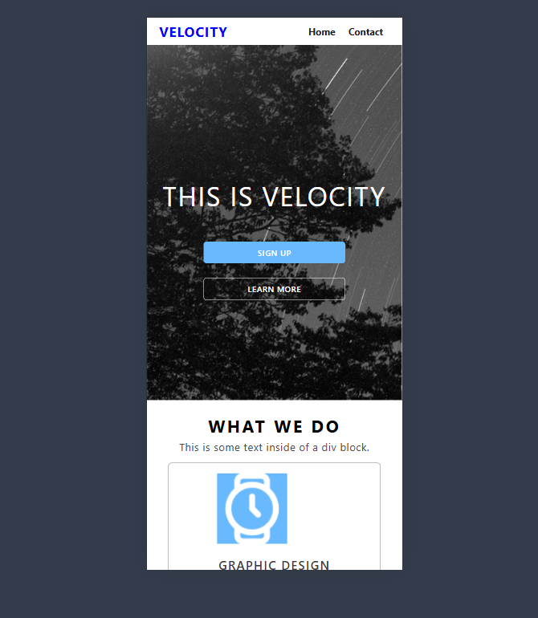

# 🌐 Velocity - Responsive Web Design

## 🖼 Preview
### 🖥️ Desktop View

### 📱 Mobile View

This project showcases a **responsive** web design named **Velocity**. It is built using **HTML, CSS, and SCSS** to ensure seamless performance on both desktop and mobile devices.

## 📌 Features
- 🎨 **Modern & Clean Design** – Elegant UI with smooth animations
- 📱 **Fully Responsive** – Works perfectly on mobile and desktop
- 💨 **Optimized Performance** – Lightweight and fast loading
- 🎭 **CSS Animations** – Interactive and engaging elements
- 🌙 **Dark & Light Mode** (Optional customization)

## 🛠 Technologies Used
- **HTML5** – For structuring the web pages
- **CSS3 & SCSS** – For styling and responsive layout
- **Flexbox & Grid** – To ensure proper alignment and responsiveness
- **Google Fonts & Icons** – For enhanced typography and design

## 🎯 Author & Contact
- **Author:**  Faridun11
- **Email:** faridunfakhridinov777@gmail.com
- **GitHub:** [Faridun11](https://github.com/Faridun11)

Enjoy the project and don’t forget to ⭐ star the repository if you find it useful! 🚀

